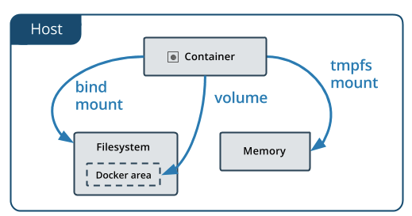

#Creacio de "app" de docker compose

Primer hem d'instalar el paquet de docker compose

```
dnf -y install docker-compose

```

#Enxegar docker compose

```
[isx53320159@i12 docker-compose]$ docker-compose up -d
Creating network "dockercompose_mynet" with the default driver
Creating kserver.edt.org ... 
Creating sshd.edt.org ... 
Creating sshd.edt.org
Creating sshd.edt.org ... done
```
#Parar docker compose
```
[isx53320159@i12 docker-compose]$ docker-compose downS
topping kserver.edt.org ... done
Stopping sshd.edt.org    ... done
Removing kserver.edt.org ... done
Removing sshd.edt.org    ... done
Removing network dockercompose_mynet
```

#Quan tu enxegas un docker compose y aquestes maquines no tenen definides un nom de host o de container automaticament agafa el nom del directori on es troba el fitxer de execució

#En aquets exemple veiem que en el fitxer de creacio de compose les maquines no tenen nom de host ni de container

```
  version: "2"
services:
  kserver:
    image: raulbaena/k18:kserver
    networks:
      - mynet
  sshd:
    image: raulbaena/k18:sshd
    networks:
      - mynet        
networks:
 mynet:
```

#Executem el docker compose y automaticament se li asiganara un nom de container y de host als dockers creats

```
[isx53320159@i12 docker-compose]$ docker ps
CONTAINER ID        IMAGE                   COMMAND                  CREATED             STATUS              PORTS               NAMES
ca3857f9f4bd        raulbaena/k18:kserver   "/opt/docker/start..."   30 seconds ago      Up 29 seconds                           dockercompose_kserver_1
6d231d0afd36        raulbaena/k18:sshd      "/opt/docker/start..."   30 seconds ago      Up 29 seconds                           dockercompose_sshd_1
```

#Afegim un altre servei al docker compose, hem afegit el servei portainer
```
version: "2"
services:
  kserver:
    image: raulbaena/k18:kserver
    networks:
      - mynet
  sshd:
    image: raulbaena/k18:sshd
    networks:
      - mynet     
  portainer:
    image: portainer/portainer
    ports:
      - "9000:9000" #Primer es el port del host y despres el del container
    volumes:
      - "/var/run/docker.sock:/var/run/docker.sock" #Es defineix un volum podem montar part del disc dur del pc al docker
        #Estem fent un bin mount, es que quin directori del pc ha de montar a quin direcotri del container
        #Named volume
    networks:
      - mynet   
networks:
 mynet:
```

#Exemple de execucuio del portainer

```
[isx53320159@i12 docker-compose]$ docker-compose up -d
Creating network "dockercompose_mynet" with the default driver
Creating dockercompose_portainer_1 ... 
Creating dockercompose_sshd_1 ... 
Creating dockercompose_kserver_1 ... 
Creating dockercompose_portainer_1
Creating dockercompose_sshd_1
Creating dockercompose_portainer_1 ... done
[isx53320159@i12 docker-compose]$ docker ps
CONTAINER ID        IMAGE                   COMMAND                  CREATED             STATUS              PORTS                    NAMES
37d0aa7594b6        raulbaena/k18:kserver   "/opt/docker/start..."   3 seconds ago       Up 3 seconds                                 dockercompose_kserver_1
e4a1920aa5b0        portainer/portainer     "/portainer"             3 seconds ago       Up 3 seconds        0.0.0.0:9000->9000/tcp   dockercompose_portainer_1
cb506594a4f1        raulbaena/k18:sshd      "/opt/docker/start..."   3 seconds ago       Up 3 seconds                                 dockercompose_sshd_1
```

##Entrem amb el navegador a locahost:9000 y veurem else stack que tenim
```

```

#Named volume

```
version: "2"
services:
  kserver:
    image: raulbaena/k18:kserver
    volumes: 
      - "krb5data:/var/kerberos" #Creem un volum on es guardaran les coses del docker
    networks:
      - mynet
  sshd:
    image: raulbaena/k18:sshd
    networks:
      - mynet     
  portainer:
    image: portainer/portainer
    ports:
      - "9000:9000"
    volumes:
      - "/var/run/docker.sock:/var/run/docker.sock"
    networks:
      - mynet   
networks:
 mynet:
volumes: 
 krb5data: #Declarem el volum al final del fitxer
```

#Enxeguem els containers amb els noms que li corresponen amb la configuracio del fitxer


```
version: "2"
services:
  kserver:
    image: raulbaena/k18:kserver
    container_name: kserver.edt.org
    hostname: kserver.edt.org
    volumes: 
      - "krb5data:/var/kerberos"
    networks:
      - mynet
  sshd:
    image: raulbaena/k18:sshd
    container_name: sshd.edt.org
    hostname: sshd.edt.org
    networks:
      - mynet     
  portainer:
    image: portainer/portainer
    ports:
      - "9000:9000"
    volumes:
      - "/var/run/docker.sock:/var/run/docker.sock"
    networks:
      - mynet   
networks:
 mynet:
volumes: 
 krb5data:

[isx53320159@i12 docker-compose]$ docker-compose up -d
Creating network "dockercompose_mynet" with the default driver
Creating kserver.edt.org ... 
Creating dockercompose_portainer_1 ... 
Creating sshd.edt.org ... 
Creating kserver.edt.org
Creating sshd.edt.org
Creating kserver.edt.org ... done
```

#Ens conectem al servidor de kerberos y iniciem sessió com administrador
```
[isx53320159@i12 docker-compose]$ docker exec -it kserver.edt.org /bin/bash
[root@kserver docker]# kadmin -p pau
Authenticating as principal pau with password.
Password for pau@EDT.ORG: 
kadmin:  
kadmin:  listprincs  
K/M@EDT.ORG
anna@EDT.ORG
host/sshd.edt.org@EDT.ORG
jordi@EDT.ORG
julia@EDT.ORG
kadmin/5b5026b10724@EDT.ORG
kadmin/admin@EDT.ORG
kadmin/changepw@EDT.ORG
kiprop/5b5026b10724@EDT.ORG
krbtgt/EDT.ORG@EDT.ORG
marta/admin@EDT.ORG
marta@EDT.ORG
pau@EDT.ORG
pere@EDT.ORG
superuser@EDT.ORG
user01@EDT.ORG
user02@EDT.ORG
user03@EDT.ORGi
```
#Eliminem l'usuari03 y afegim dos usuaris nous
```
kadmin:  delprinc user03
Are you sure you want to delete the principal "user03@EDT.ORG"? (yes/no): yes
Principal "user03@EDT.ORG" deleted.
Make sure that you have removed this principal from all ACLs before reusing.
kadmin:  addprinc -pw new01 new01
WARNING: no policy specified for new01@EDT.ORG; defaulting to no policy
Principal "new01@EDT.ORG" created.
kadmin:  addprinc -pw new02 new02  
WARNING: no policy specified for new02@EDT.ORG; defaulting to no policy
Principal "new02@EDT.ORG" created.
kadmin:  q
```
#Parem les maquine y les tornem a enxegar, ens contectem al kerberos server y podem observar que els cambis fets anteriorment encara estan
```
[isx53320159@i12 docker-compose]$ docker exec -it kserver.edt.org /bin/bash
[root@kserver docker]# kadmin -p pau
Authenticating as principal pau with password.
Password for pau@EDT.ORG: 
kadmin:  listprincs
K/M@EDT.ORG
anna@EDT.ORG
host/sshd.edt.org@EDT.ORG
jordi@EDT.ORG
julia@EDT.ORG
kadmin/5b5026b10724@EDT.ORG
kadmin/admin@EDT.ORG
kadmin/changepw@EDT.ORG
kiprop/5b5026b10724@EDT.ORG
krbtgt/EDT.ORG@EDT.ORG
marta/admin@EDT.ORG
marta@EDT.ORG
new01@EDT.ORG
new02@EDT.ORG
pau@EDT.ORG
pere@EDT.ORG
superuser@EDT.ORG
user01@EDT.ORG
user02@EDT.ORG
user03@EDT.ORG
kadmin:  
```
```

```

#On se guarden els volume mount? a /var/lib/docker/volumes

```
[root@i12 ~]# cd /var/lib/docker/volumes/
[root@i12 volumes]# ll
total 44
drwxr-xr-x. 3 root root  4096 Feb 28 09:39 4db41225a25e5e1fc8ce6f144d7d6c6229743eef13a63852b043bc7f834b902c
drwxr-xr-x. 3 root root  4096 Feb 28 09:33 51757a6b1df40c08003a3c87788ff84e373f0422ca5c5a101bbeccdba720407c
drwxr-xr-x. 3 root root  4096 Feb 28 09:28 b1c2e26de88fcb696b00f8839a8b065710c822d280770d3c67000f8dfdc03f7b
drwxr-xr-x. 3 root root  4096 Feb 28 09:13 dd94fefe56471508ad7aa6c891a67f6ba857cb946cc6a6534e747604e0acbd48
drwxr-xr-x. 3 root root  4096 Feb 28 09:28 dockercompose_krb5data
-rw-------. 1 root root 32768 Feb 28 09:39 metadata.db
```

#Si entrem al directori amb el nom d'aquestes maquines estaran els nostres bind mounts
```
[root@i12 volumes]# ll dockercompose_krb5data/_data/
total 8
drwxr-xr-x. 3 root root 4096 Aug 21  2018 krb5
drwxr-xr-x. 2 root root 4096 Feb 28 09:28 krb5kdc
```

#Exemple D

#Editem el fitxer docker-compose y afegim la linea deploy y cambiem la versio de compose
```
version: "3"
services:
  kserver:
    image: raulbaena/k18:kserver
    container_name: kserver.edt.org
    hostname: kserver.edt.org
    deploy:
      replicas: 3
    volumes: 
      - "krb5data:/var/kerberos"
    networks:
      - mynet
  sshd:
    image: raulbaena/k18:sshd
    container_name: sshd.edt.org
    hostname: sshd.edt.org
    networks:
      - mynet     
  portainer:
    image: portainer/portainer
    ports:
      - "9000:9000"
    volumes:
      - "/var/run/docker.sock:/var/run/docker.sock"
    networks:
      - mynet   
networks:
 mynet:
volumes: 
 krb5data:
```

#Executem les maquines
```
[isx53320159@i12 docker-compose]$ docker-compose up -d
WARNING: Some services (kserver) use the 'deploy' key, which will be ignored. Compose does not support 'deploy' configuration - use `docker stack deploy` to deploy to a swarm.
Creating network "dockercompose_mynet" with the default driver
Creating kserver.edt.org ... 
Creating sshd.edt.org ... 
Creating dockercompose_portainer_1 ... 
Creating kserver.edt.org
Creating dockercompose_portainer_1
Creating sshd.edt.org ... done
```

#Stack

#Execucio del stack deploy (es lo mateix de docker compose, pero un stack s'executa en un cnjunt d'ordinadors)

#Cada vez que creemos una nueva maqina de amazon tendremos que instslar docker de nuevo, mirar como se hace en
```
https://docs.docker.com/install/linux/docker-ce/fedora/
```

#Iniciar swarm
```
[isx53320159@i12 docker-compose]$ docker swarm init
Swarm initialized: current node (rp97eoi5eml98ji7x9iar06n8) is now a manager.

To add a worker to this swarm, run the following command:

    docker swarm join --token SWMTKN-1-18xg1jh78vix2r2w0xr54qoo11eeg6tqhe8zex8e77s3zj6v3f-6um415l1ysqydqgpeo19dlya5 192.168.2.42:2377

To add a manager to this swarm, run 'docker swarm join-token manager' and follow the instructions.
```
#Qualsevol que tingui el token generat et podras adjuntar en el swarm creat

#Llistar els nodes o treballadors y managers que tnim al swarm
```
[isx53320159@i12 docker-compose]$ docker node ls
ID                            HOSTNAME            STATUS              AVAILABILITY        MANAGER STATUS      ENGINE VERSION
rp97eoi5eml98ji7x9iar06n8 *   i12                 Ready               Active              Leader              18.09.0
```

#Creem el stack
```
[isx53320159@i12 docker-compose]$ docker stack deploy -c docker-compose.yml myapp
Ignoring deprecated options:

container_name: Setting the container name is not supported.

Creating network myapp_mynet
Creating service myapp_sshd
Creating service myapp_portainer
Creating service myapp_kserver
```
#Exemple a visualizer
```
version: "3"
services:
  kserver:
    image: raulbaena/k18:kserver
    container_name: kserver.edt.org
    hostname: kserver.edt.org
    deploy:
      replicas: 3
    volumes: 
      - "krb5data:/var/kerberos"
    networks:
      - mynet
  sshd:
    image: raulbaena/k18:sshd
    container_name: sshd.edt.org
    hostname: sshd.edt.org
    networks:
      - mynet     
  portainer:
    image: portainer/portainer
    ports:
      - "9000:9000"
    volumes:
      - "/var/run/docker.sock:/var/run/docker.sock"
    networks:
      - mynet 
  visualizer:
    image: dockersamples/visualizer:stable
    ports:
      - "8080:8080"
    volumes:
      - "/var/run/docker.sock:/var/run/docker.sock"
    networks:
      - mynet 
networks:
 mynet:
volumes: 
 krb5data:
```

#Creem l'stack
```
[isx53320159@i12 docker-compose]$ docker stack deploy -c docker-compose.yml myapp
Ignoring deprecated options:

container_name: Setting the container name is not supported.

Creating network myapp_mynet
Creating service myapp_portainer
Creating service myapp_visualizer
Creating service myapp_kserver
Creating service myapp_sshd
```

#Mirem les maquines enxegades
```
[isx53320159@i12 docker-compose]$ docker ps
CONTAINER ID        IMAGE                             COMMAND                  CREATED              STATUS              PORTS               NAMES
617e9a6ed0c7        dockersamples/visualizer:stable   "npm start"              About a minute ago   Up About a minute   8080/tcp            myapp_visualizer.1.1e8gs3hq4d2soaumdpwu981eg
56c9a94e30d3        raulbaena/k18:sshd                "/opt/docker/startup…"   About a minute ago   Up About a minute                       myapp_sshd.1.mip10ji4rnir1dxyh61ig6p4j
610cbf39be8d        raulbaena/k18:kserver             "/opt/docker/startup…"   About a minute ago   Up About a minute                       myapp_kserver.1.7g4p9pdcxl2rqueq2ivnmm28y
0e5c3f5692ee        raulbaena/k18:kserver             "/opt/docker/startup…"   About a minute ago   Up About a minute                       myapp_kserver.2.xrwkpn6do9p7y689cztwf73ai
7bd7d212dfff        raulbaena/k18:kserver             "/opt/docker/startup…"   About a minute ago   Up About a minute                       myapp_kserver.3.x4g47v6cjjmbpn2kcmlpyr6xn
ceb975162293        portainer/portainer:latest        "/portainer"             About a minute ago   Up 59 seconds       9000/tcp            myapp_portainer.1.y67j0nge1hpwsunpfupktrl4j
```

#Mirem l'stack
```
[isx53320159@i12 docker-compose]$ docker stack ps myapp 
ID                  NAME                 IMAGE                             NODE                DESIRED STATE       CURRENT STATE                ERROR               PORTS
mip10ji4rnir        myapp_sshd.1         raulbaena/k18:sshd                i12                 Running             Running about a minute ago                       
7g4p9pdcxl2r        myapp_kserver.1      raulbaena/k18:kserver             i12                 Running             Running about a minute ago                       
1e8gs3hq4d2s        myapp_visualizer.1   dockersamples/visualizer:stable   i12                 Running             Running about a minute ago                       
y67j0nge1hpw        myapp_portainer.1    portainer/portainer:latest        i12                 Running             Running about a minute ago                       
xrwkpn6do9p7        myapp_kserver.2      raulbaena/k18:kserver             i12                 Running             Running about a minute ago                       
x4g47v6cjjmb        myapp_kserver.3      raulbaena/k18:kserver             i12                 Running             Running about a minute ago    
```

#Llistar els serveis que tenim enxegats
```
[isx53320159@i12 docker-compose]$ docker service ls
ID                  NAME                MODE                REPLICAS            IMAGE                             PORTS
xoontwqhda8e        myapp_kserver       replicated          3/3                 raulbaena/k18:kserver             
weqtnoiylms0        myapp_sshd          replicated          1/1                 raulbaena/k18:sshd                
ms8hev1qeinh        myapp_visualizer    replicated          1/1                 dockersamples/visualizer:stable   *:8080->8080/tcp
```

#Llistar els stacks que amb el numero de serveis
```
[isx53320159@i12 docker-compose]$ docker stack ls
NAME                SERVICES            ORCHESTRATOR
myapp               3                   Swarm
```

